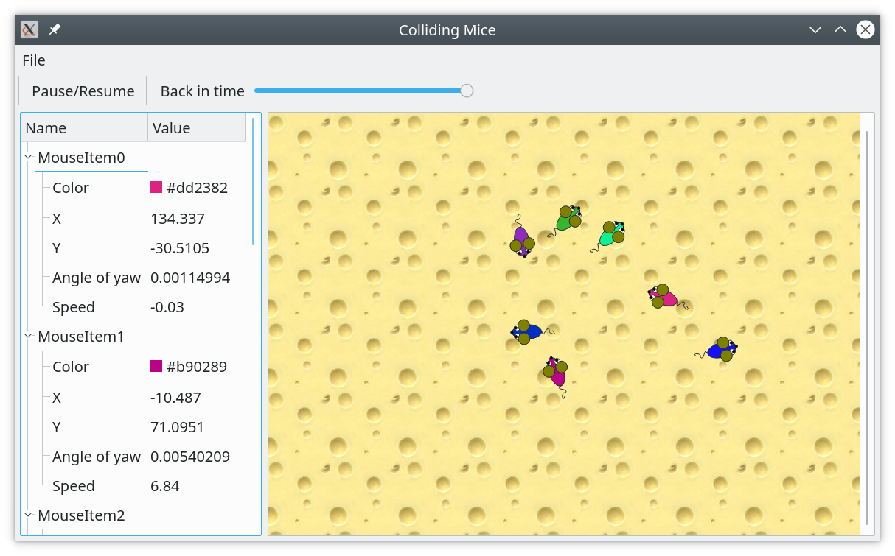

# Model View ViewModel framework for large C++ Qt applications

[](https://travis-ci.org/gpospelov/qt-mvvm)
[](https://ci.appveyor.com/project/gpospelov/qt-mvvm)

## Overview

This is model-view-viewmodel framework intended for large Qt based 
scientific applications written in C++.
The definition of `large` is quite arbitrary and means something 
above 30k and below 300k lines of code. Project was created as a playground toward GUI refactoring
of [BornAgain project](https://www.bornagainproject.org).

Main features of framework are:

+ Serialization of application models to json
+ Undo/redo based on command pattern
+ Some scientific graphics
+ Automatic generation of widgets from model content
+ Flexible layout of Qt's trees and tables

## Example

If you are familiar with Qt's reach example section you might
saw it's funny `collidingmice` example showing basics of
`QGraphicsScene`.


To demonstrate the idea behind `qt-mvvm` library the code of the example
has been slightly modified. The mice data has been moved into dedicated model,
the content of the model was shown both in the `QGraphicsScene` and in 
`QTreeView`. It is possible now to save the data in json file and later 
load the session with saved mice positions. Additionally, it is possible
to go back in time  and watch how mice are moving in opposite direction
by dragging a slider



## Installation instruction

```
git clone --recurse-submodules  https://github.com/gpospelov/qt-mvvm.git
mkdir <build-dir>; cd <build-dir>
cmake <source>; make -j8; ctest

# run one of examples
<build-dir>/bin/collidingmice
```

## More explanations

The main idea of the framework is following. The whole data of GUI application 
is stored in `SessionModel`, tree like structure which is intentionally made Qt-independent.
I tried to get rid from Qt here as much as possible to not to let Qt logic
(e.g. `QModelIndex`) penetrate into business logic of the GUI application. `SessionModel` has undo/redo,
serialization and minimal signaling to handle business logic.

> Strictly speaking, QVariant is still there but eventually will be replaced with std::variant.

`SessionModel` is supplemented with `ViewModel` which is derived from `QAbstractItemModel` and intended to work together with Qt's trees
and tables. Additional machinery allows to have something in the line of ancient [Qt property browser framework](https://doc.qt.io/archives/qq/qq18-propertybrowser.html). `ViewModel` doesn't own the data but simply serve
as a `view` to different parts of `SessionModel`. It is much easier now to generate tables and trees with arbitrary layouts without diving into the nightmare of
`QAbstractProxyModel`.

## Size of framework

+ 15k loc of libraries (libmvvm_model.so and linbmmv_viewmodel.so)
+ 15k loc of tests
+ 10k of user examples

## Disclaimer

Project is under active development.