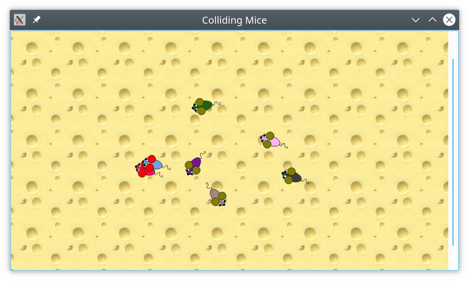

# Model View ViewModel framework for large C++ Qt applications

[](https://travis-ci.org/gpospelov/qt-mvvm)
[](https://ci.appveyor.com/project/gpospelov/qt-mvvm)

## Overview

This is model-view-viewmodel framework intended for large Qt based 
scientific applications written in C++.
The definition of `large` is quite arbitrary and means something 
above 30k and below 300k lines of code. Project was created as a playground toward GUI refactoring
of [BornAgain project](https://www.bornagainproject.org).

Main features of framework are:

+ Application data model design allowing to store almost any type of data
+ View model design to show parts of data model in Qt widgets
+ Serialization of application models to json
+ Undo/redo based on command pattern
+ Some scientific graphics
+ Automatic generation of widgets from model content
+ Flexible layout of Qt's trees and tables

## Example

If you are familiar with Qt's reach example section you might
saw it's funny `collidingmice` example showing basics of
`QGraphicsScene`.



To demonstrate the idea behind `qt-mvvm` library the code of the example
has been slightly modified. The mice data has been moved into dedicated model,
the content of the model was shown both in the `QGraphicsScene` and in 
`QTreeView`. It is possible now to save the data in json file and later 
load the session with saved mice positions. Additionally, it is possible
to go back in time  and watch how mice are moving in opposite direction
by dragging a slider:


The demo demonstrates that by using `qt-mvvm` library it is possible 
to equip the GUI with serialization and undo/redo and to provide proper 
model/view via relatively small modifications to the original code.
Implementing these features from the scratch in Qt would take
much more time and resulting code wouldn't be easily transferable to different project.

This and other examples can be found in `examples` sub-directory of qt-mvvm package.

## Installation instruction

```
git clone --recurse-submodules  https://github.com/gpospelov/qt-mvvm.git
mkdir <build-dir>; cd <build-dir>
cmake <source>; make -j8; ctest

# run one of examples
<build-dir>/bin/collidingmice
```

## More explanations

The main idea of the framework is the following. The whole data of GUI application 
is stored in the tree like structure `SessionModel`. This part of code resides in
`libmvvm_model.so` library and it is intentionally made Qt-independent.

> Strictly speaking, QVariant is still there but eventually will be replaced with std::variant.

The decision to not to depend on Qt here was connected with the fact, that
large Qt based GUI applications get quickly spoiled with Qt presentation 
logic - `QModelIndex` and others penetrates into business logic of GUI application
and appears everywhere, even in places which has nothing to do with Qt graphics.

`SessionModel` has undo/redo,
serialization and it's own minimal signaling to handle business logic.

Second library, `libmmv_viewmodel.so`, contains `ViewModel` and Co
as counterpart of `SessionModel` in Qt world.
`ViewModel` doesn't own the data but simply serve
as a `view` to different parts of `SessionModel`.
It is derived from `QAbstractItemModel` and intended to work together with Qt's trees and tables.  It is much easier now to generate tables and trees with arbitrary layouts without diving into the nightmare of
`QAbstractProxyModel`.
Additional machinery allows to have something in the line of ancient [Qt property browser framework](https://doc.qt.io/archives/qq/qq18-propertybrowser.html). 

## Size of framework

+ 15k loc of libraries (libmvvm_model.so and libmmv_viewmodel.so)
+ 15k loc of tests
+ 10k of user examples

## Disclaimer

Project is under active development.