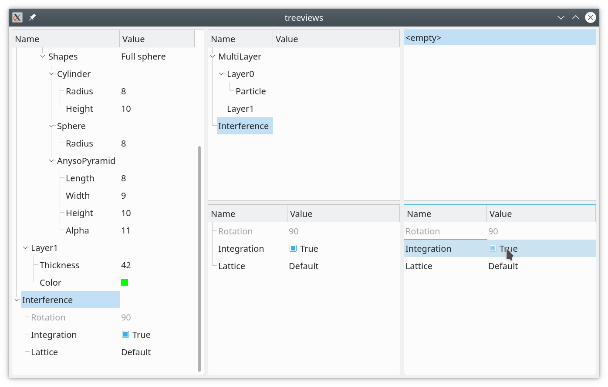

# Example "treeviews".

Example shows how to represent the model using trees with different layouts.

Application model contains hierarchical structure, `MultiLayer`, which holds `Layer` structures populated with particles. Every item have some editable properties.

+ Tree on the left shows application model in the form of two column tree
with standard `property name` and `property value` layout. All items are shown.
+ Top tree at the center demonstrates filtered tree, where only top-level-items are shown and all property items (leaves) are filtered out.
+ Bottom tree at the center shows currently selected branch corresponding to the `Particle`.
+ Top tree at the right shows undo-redo stack where user can walk through modifications done to the data.
+ Bottom tree at the right shows properties (leaves) of currently selected `Particle` item.

Example also demonstrates following features:

## Group property

This is a special object `Shapes` belonging to the `Particle`. It contains predefined shapes the particle can have, together with currently selected shape.
Only property `Radius` of currently selected shape `Full sphere` is shown, other children and children's properties are hidden in the property editor. 

## Business logic

Item `Interference` demonstrates how to implement business logic. Every time user clicks on its `Integration flag` property, the property `Rotation` gets either enabled or disabled.

Business logic is implemented via lambda's on board of `InterferenceItem` (see code for details).
